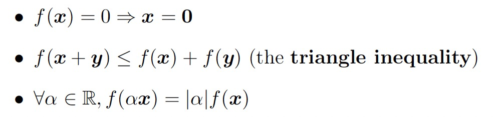
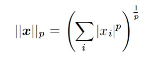
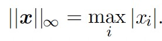
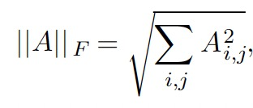

# Chapter 2 线性代数基础

* 标量，向量，矩阵，张量
* 矩阵相乘：element-wise product（Hadamard product） $A\circ B$ ; dot product $A\cdot B$ 
* 单位矩阵与逆矩阵：逆矩阵大多用在理论分析中，很少用于实际计算，因为数字计算机提供的逆矩阵计算精确度有限
* 线性独立与span：a span of a set of vectors is the set of all points obtainable by the linear combination of the original vectors. 对于 $$Ax=b$$ 是否存在解可以理解为 点$$b$$是否可以在由矩阵 $$A$$ 的列空间张成的区域中找到；矩阵存在逆的条件为它是一个奇异矩阵，奇异矩阵：包含线性独立列的方阵
* 范数： function mapping vectors to non-negative values satisfying the following properties:

  

* $$p$$ 范数  ，max norm，矩阵范数（Frobenius norm）

     

  

